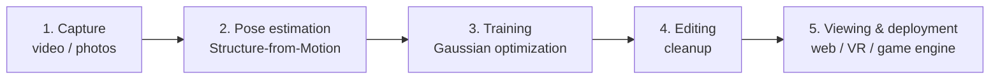

# The Gaussian Splatting Pipeline

This document explains how a 3D Gaussian Splatting (3DGS) scene is produced, from a video of a room to an interactive 3D experience. It is written as a reference for comparing tools: every tool on the market covers one or more of the stages below, and tools should only be compared within the same stage.

## Overview

| Stage | Input | Output | Example tools |
|---|---|---|---|
| 1. Capture | The physical scene | Images or video frames | Phone, camera, tripod robot, LiDAR scanner (XGRIDS) |
| 2. Pose estimation | Images | Camera poses and a sparse point cloud | COLMAP, GLOMAP, RealityScan |
| 3. Training | Images, poses and point cloud | Gaussian splat file (.ply) | Nerfstudio / Splatfacto, Brush, LichtFeld Studio, Postshot |
| 4. Editing | Raw splat | Cleaned splat | SuperSplat |
| 5. Viewing & deployment | Cleaned splat | Real-time interactive scene | Spark, Unity or Unreal plugins |

End-to-end services such as Polycam, Scaniverse, KIRI Engine or Teleport bundle stages 1 to 4 into a single product. They are convenient but opaque: you cannot inspect or control the intermediate steps.

---

## 1. Capture

**Goal:** record the scene from many viewpoints, with enough overlap between consecutive images for the software to relate them.

**Input:** the physical room. **Output:** a set of images, often frames extracted from a video (for example with `ffmpeg`, at 2 to 5 frames per second).

**What matters:**

- **Coverage.** Every surface that the end user may look at must be seen by several images from different angles. Anything unseen will be missing or blurry.
- **Overlap.** Consecutive images should share most of their content (roughly 60 to 80%).
- **Sharpness.** Motion blur degrades every later stage. Move slowly, use good lighting, and prefer a fast shutter speed.
- **Consistent exposure.** Fixed exposure and white balance avoid color flickering between views.

**Operating room specifics:** white, featureless walls give the next stage nothing to match. Adding texture (posters, stickers) or using a controlled capture path (a tripod robot following a predefined pattern) directly addresses this. LiDAR scanners avoid the problem by measuring depth directly.

---

## 2. Pose estimation (Structure-from-Motion)

**Goal:** determine, for every image, where the camera was and which way it was pointing.

**Input:** images. **Output:** one camera pose per image (position and orientation), the camera intrinsics (focal length, lens distortion), and a sparse 3D point cloud.

**How it works:**

1. **Feature detection.** Find distinctive points in each image, such as corners and texture patterns.
2. **Feature matching.** Find the same points across different images.
3. **Triangulation and bundle adjustment.** Solve jointly for the 3D position of the points and the pose of the cameras that best explain all the matches.

**Why it matters:** this is the most fragile stage. If poses are wrong, the trainer tries to reconcile inconsistent views and produces blur and floaters, and no training setting can fix it. Textureless surfaces are the main cause of failure, because they yield no features to match.

**Tools:** COLMAP (the standard, incremental and accurate but slow), GLOMAP (global approach, much faster on large captures), RealityScan (free, graphical). Learned approaches such as MASt3R or VGGT are more robust when texture is scarce.

---

## 3. Training (Gaussian optimization)

**Goal:** build a 3D representation that, when rendered from each camera pose, reproduces the corresponding image.

**Input:** images, camera poses, and the sparse point cloud. **Output:** a file (usually `.ply`) containing a few hundred thousand to several million 3D Gaussians.

**What a Gaussian is:** a small, soft, semi-transparent ellipsoid, described by:

- a **position** (its center in 3D),
- a **scale and rotation** (its shape and orientation),
- an **opacity**,
- a **color**, which can vary with the viewing direction (stored as spherical harmonics) to capture reflections and shading.

**How training works:**

1. **Initialization.** One Gaussian is placed at each point of the sparse point cloud.
2. **Rendering.** For a training image, all Gaussians are projected onto the image plane and blended front to back. This is the "splatting" step, and it is fast because it is rasterization, not ray marching.
3. **Comparison.** The rendered image is compared with the real photo, which gives an error (loss).
4. **Update.** Gradients of that error adjust every Gaussian's parameters.
5. **Densification and pruning.** Periodically, Gaussians are split or cloned where detail is missing, and removed where they are nearly transparent or useless.
6. Repeat, typically for about 30,000 iterations.

**What matters:** training time, GPU memory (VRAM), final quality, and the number of Gaussians, which drives file size and rendering speed.

**Tools:** Nerfstudio / Splatfacto (built on the gsplat library), Brush, LichtFeld Studio, Postshot. Method variants that address specific issues are often available inside these tools: 2DGS or PGSR for flat surfaces, Mip-Splatting for anti-aliasing, MCMC densification for fewer floaters.

---

## 4. Editing (cleanup)

**Goal:** remove artifacts before the scene is shown to anyone.

**Input:** raw splat. **Output:** cleaned splat.

**Typical operations:**

- **Delete floaters**, the stray blobs floating in mid-air, usually caused by poorly constrained regions.
- **Crop** everything outside the area of interest (for example, what was visible through a door or window).
- **Reorient and rescale** the scene so the floor is level and dimensions are realistic.
- **Compress** the file for delivery (formats such as SPZ or SOG are much smaller than PLY).

**Tools:** SuperSplat, and the editing features built into some trainers such as LichtFeld Studio.

---

## 5. Viewing and deployment

**Goal:** render the scene in real time for the end user.

**Input:** cleaned splat. **Output:** an interactive experience.

**Targets:**

- **Web browser:** easiest to share, runs on most devices. Viewers include Spark and SuperSplat's embeddable viewer.
- **Game engine (Unity, Unreal):** needed to add interactions, scenarios, or training exercises on top of the scene.
- **VR headset:** the most immersive. It requires a high and stable frame rate (typically 72 to 90 fps per eye), which limits how many Gaussians the scene can contain.

**Operating room specifics:** since the goal is immersive staff training, deployment constraints (headset, frame rate, whether interactions are needed) should be decided early, because they set a budget on scene size that affects training choices upstream.

---

## Where things usually go wrong

| Symptom | Most likely stage | Typical cause |
|---|---|---|
| Training fails or the scene is completely incoherent | 2. Pose estimation | Not enough matches, often due to textureless surfaces |
| Blurry walls, holes | 1. Capture | Missing coverage or no texture |
| Floaters in the air | 3. Training, 1. Capture | Regions seen by too few images |
| Color flickering between views | 1. Capture | Automatic exposure or white balance |
| Low frame rate in the headset | 3. Training, 4. Editing | Too many Gaussians, no compression |

The general rule: problems travel downstream. A defect at one stage cannot be fully fixed by a later one, so the earliest stages (capture and poses) deserve the most attention.
